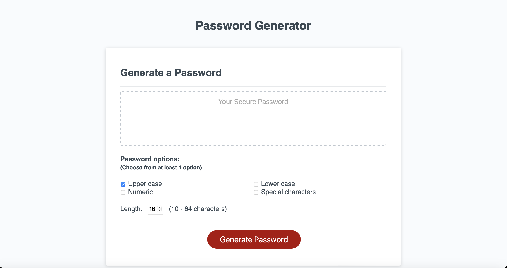
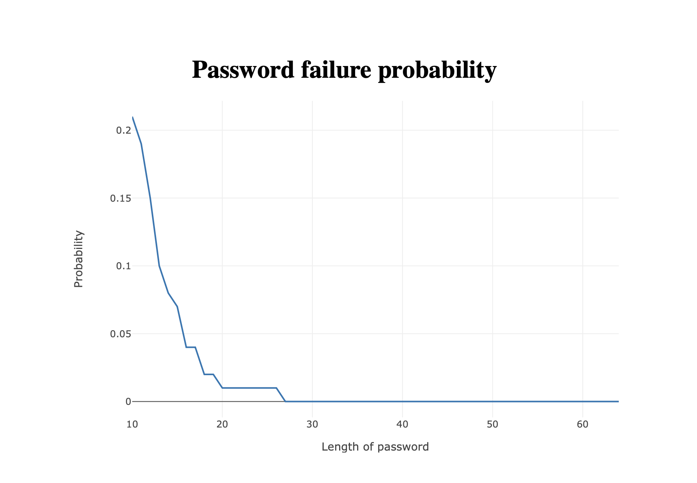

# password-generator

The goal of this challenge was to create an application that an employee can use to generate a random password based on criteria they've selected by modifying starter code.

## Implementation
I've decided to tackle this problem by pushing the options selected by user into an array and then picking password characters randomly from that array. I've created an extra helper function that does just that - pushes options into array and then returns it.

User's inputs are validated (must choose from at least 1 options and the length has to be between 10 to 64) if the input doesn't satisfy the requirements an error message is shown.

Website is responsive and you can check it here:
https://michalous.github.io/password-generator/

There's a non zero probability that my method will lead to a password which doesn't have at least one character from each selected group. The graph below is for a situation where all 4 options are selected (If less than 4 options are selected then the probability is smaller).

Or you can have a look here:
https://michalous.github.io/password-failure

Since the challenge doesn't specify whether this is an issue or not (randomly not picking a character from a selected group) I'm leaving it as it is. But I'm standing by for any corrections in the code. 